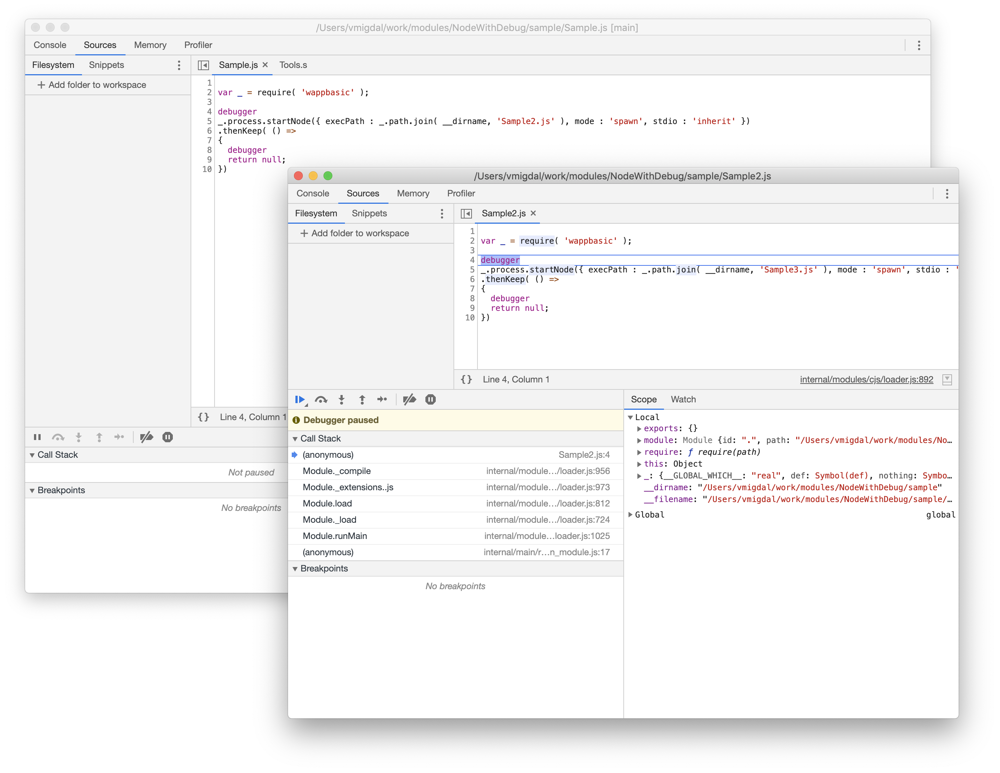

# utility::DebugNode [](https://github.com/Wandalen/DebugNode/actions/workflows/StandardPublish.yml) [](https://github.com/emersion/stability-badges#stable)
Nodejs debugger based on Electron and Chrome DevTools.



## Features

- Default DevTools functionality
- Child process debugging
- Console supports ansi styles
- Restart debugging( F5 )
- Debugger window closing resumes execution

## Installation

``` npm install -g debugnode@alpha```

## Usage

``` debugnode sample/trivial/Sample.s arg1 arg2 ```

[More information about usage](./doc/tutorial/HowToUse.md)
